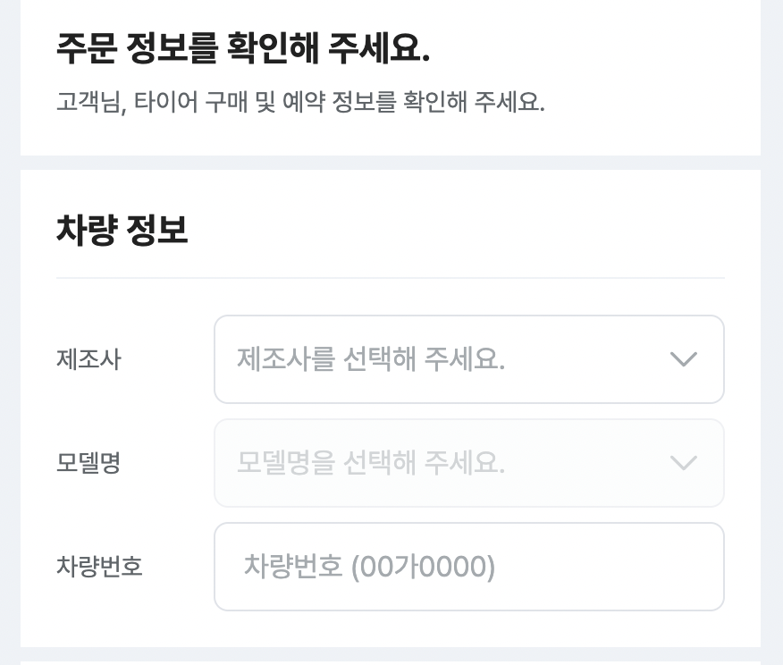

# 주문자의 정보를 가지고 있다면, 미리 input 채워두기(pre-fill)



최근 출시된 프로젝트 [닥터차의 타이어 커머스](https://tire.doctor-cha.com/)에서 타이어를 구매하려는 소비자는 자신의 타이어 사이즈를 알아야합니다.

당장 눈 앞에 자동차가 있는 경우라면 상관없지만, 대부분의 운전자는 자신의 타이어 사이즈를 외우고 다니진 않습니다.

그래서 닥터차 타이어 커머스에서는 차량번호를 통해 자신의 차량 정보를 조회하고, 그에 맞는 타이어 제품을 조회해 예약할 수 있습니다.

그리고 타이어 장착점 예약을 마치기 위해서는 차량정보(제조사, 모델명, 차량번호)를 필수로 입력해야합니다.

원하는 타이어를 선택하고 예약 지점까지 모두 고른 상태에서 더 편하게 구매를 완료하게 하는 방법에는 무엇이 있을까요?

## 더 편하게 구매 완료하기

이미 차량을 조회한 유저에 대해서 차량 정보를 자동으로 입력하게 하면 좋겠습니다.

차량 정보를 조회한 유저의 정보는 로컬스토리지에 담아 보관했다가 구매가 완료되면 로컬스토리지를 비웁니다 (개인에 따라 민감 정보가 될 수 있기 때문에)

예약 화면에 진입 후 컴포넌트가 마운트되는 시점에 로컬스토리지에 담겨있던 차량 정보가 읽힙니다.

```tsx
React.useEffect(() => {
    if (window) {
      const vehicleSpec = window.localStorage.getItem("vehicle-spec");
      if (vehicleSpec) setVehicle(JSON.parse(vehicleSpec));
    }
    ...
}, []);
```

그리고 입력 form을 구성하고 있는 하위 컴포넌트들에게 초기값을 넘겨주어 기본적으로 pre-fill이 되도록 하는 것이 목표입니다.

## 기존 코드

```tsx
// 상위 컴포넌트 index.page.tsx
const [vehicle, setVehicle] = React.useState<Vehicle | null>(null);

...

<MemoizedVehicleInfoSection
  editable
  value={vehicle || undefined}
  onChange={setVehicle}
/>

...

const MemoizedVehicleInfoSection = React.memo(VehicleInfoSection);
```

```tsx
// 기존의 하위 컴포넌트 VehicleInfoSection
type VehicleInfoSectionProps = {
  editable?: boolean;
  value?: Vehicle;
  onChange?: (value: Vehicle) => void;
};

const VehicleInfoSection = ({
  editable,
  value,
  onChange,
}: VehicleInfoSectionProps) => {
  const [brand, setBrand] = React.useState<{ id: string; name: string } | null>(
    value?.brand || null
  );
  const [model, setModel] = React.useState<{ id: string; name: string } | null>(
    value?.model || null
  );
  const [plateNumber, setPlateNumber] = React.useState<string | null>(
    value?.plateNumber || null
  );

  React.useEffect(() => {
    onChange?.({ brand, model, plateNumber });
  }, [brand, model, plateNumber, onChange]);
  ...
};
```

차량 정보를 담는 3개의 input에 대해서 컴포넌트 내부에서 useState를 사용하고 있었습니다.

value로 넘어오는 vehicle이 렌더링 후 가장 처음에는 null이었다가 로컬스토리지 접근 후에 원하는 정보가 있다면 Vehicle 형태로 담깁니다.

그래서 VehicleInfoSection에서 props로 받은 value도 null에서 Vehicle로 변경됩니다.

하지만, VehicleInfoSection 내의 brand, model, plateNumber는 초기값이 null로 설정된 후 value가 업데이트 되어도 변경되지 않습니다.

value의 변화에 따라 초기값이 달라지긴 하지만, 이 경우에는 이미 렌더링 된 후 로컬스토리지에 접근해 값을 update하기 때문에 VehicleInfoSection은 이미 렌더링 된 채로 초기값이 정해져있습니다.

value의 변화를 감지해 brand, model, plateNumber를 업데이트 하는 것은 이 경우에 무한 루프에 빠지기 때문에 불가능합니다.

## 해결

애초에 VehicleInfoSection 내에서 각각의 state를 따로 관리하는 것이 큰 의미가 있을까에 대해서 생각해봤습니다.

결론은 이 경우에는 맞지 않는다는 것이었습니다.

그래서 뜯어고쳤습니다!

> 이걸 해결하지 못하고 터덜터더럴ㄹ 집에 가던 길에 토스 진유림님의 FE CONF 발표 영상을 봤는데, 다른 사람이 만든 컴포넌트를 고치는 것에 두려움을 갖지 말라고 하시더군요. 얼마든지 씹고 뜯고 맛보고 즐기라고 하는 유림님의 말씀이 확- 와닿았습니다 ㅎㅎ

brand, model, plateNumber의 상태가 필요했던 이유는 pre-fill이 되든 아니든 유저는 차량 정보를 수정할 수 있어야하기 때문입니다.

그래서 해당 정보를 수정할 수 있는 형태로 다음과 같이 변경했습니다.

```tsx
type VehicleInfoSectionProps = {
  editable?: boolean;
  value?: Vehicle;
  onChange?: (value: Vehicle) => void;
};

const VehicleInfoSection = ({
  editable,
  value = { brand: null, model: null, plateNumber: null },
  onChange,
}: VehicleInfoSectionProps) => {
  const setBrand = React.useCallback(
    (brand: { id: string; name: string } | null) => {
      onChange?.({ ...value, brand, model: null });
    },
    [onChange, value]
  );

  const setModel = React.useCallback(
    (model: { id: string; name: string } | null) => {
      onChange?.({ ...value, model });
    },
    [onChange, value]
  );

  const setPlateNumber = React.useCallback(
    (plateNumber: string | null) => {
      onChange?.({ ...value, plateNumber });
    },
    [onChange, value]
  );
  ...
}
```

이렇게 되면, value의 변화에 따라 초기값은 자연스럽게 변경될 것이고, 각각의 정보를 수정하는 것도 가능해집니다.

야호 해결했다 ㅎㅎ
