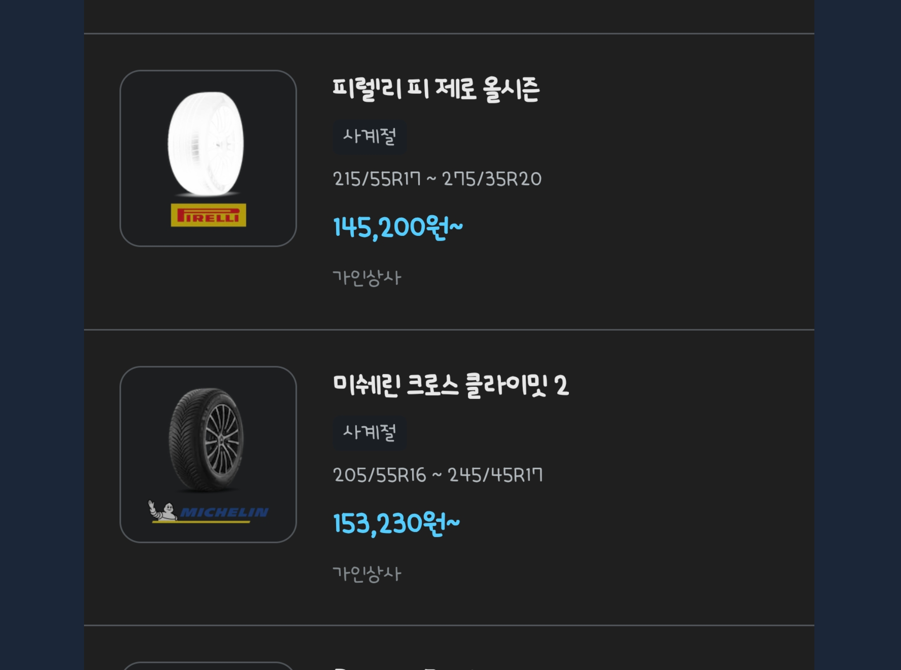
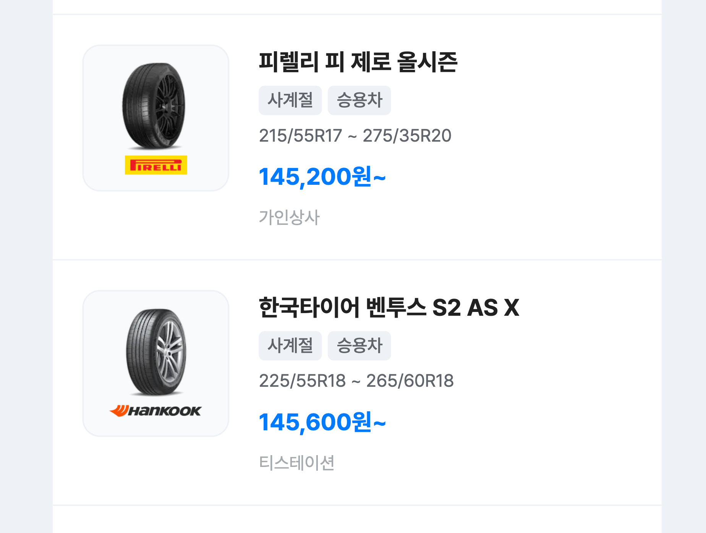

# 삼성 인터넷의 나이트 모드에 대한 고찰..

이틀을 고민한 결과가 절망적이어서 속상합니다...

관련 문서가 제공되는 것이 없어 삼성 인터넷이 제 2의 인터넷 익스플로어가 되는 것은 아닌지 걱정될 정도

## 다크 모드(dark mode)

눈의 편안함을 위해 브라우저마다 지원하는 다크모드가 있습니다.

개발자는 light와 dark 모드를 나눠서 색상을 적용할 수 있는데 매우 간단하고도 재밌는 작업이라 웹 개발을 처음 공부하는 사람들이 클론코딩으로 많이 해보는 부분 중 하나인 것 같습니다.

[MDN에서 제공하는 prefers-color-scheme 설명 부분(클릭)](https://developer.mozilla.org/ko/docs/Web/CSS/@media/prefers-color-scheme)에서 관련 코드를 쉽게 찾아볼 수 있는데 그 내용은 아래와 같습니다.

```html
<div class="day">Day (initial)</div>
<div class="day light-scheme">Day (changes in light scheme)</div>
<div class="day dark-scheme">Day (changes in dark scheme)</div>
<br />

<div class="night">Night (initial)</div>
<div class="night light-scheme">Night (changes in light scheme)</div>
<div class="night dark-scheme">Night (changes in dark scheme)</div>
```

```css
.day {
  background: #eee;
  color: black;
}
.night {
  background: #333;
  color: white;
}

@media (prefers-color-scheme: dark) {
  .day.dark-scheme {
    background: #333;
    color: white;
  }
  .night.dark-scheme {
    background: black;
    color: #ddd;
  }
}

@media (prefers-color-scheme: light) {
  .day.light-scheme {
    background: white;
    color: #555;
  }
  .night.light-scheme {
    background: #eee;
    color: black;
  }
}

.day,
.night {
  display: inline-block;
  padding: 1em;
  width: 7em;
  height: 2em;
  vertical-align: middle;
}
```

### 다크 모드 막는 방법

다크모드를 막는 방법 역시 간단합니다.

아래와 같이 meta 태그를 추가할 수도 있고

```html
<meta name="color-scheme" content="light only" />
```

아래와 같이 css 속성으로 전체 적용하는 방법도 있습니다.

```css
:root {
  color-scheme: light only;
}
```

## 삼성의 나이트 모드(night mode)

이정도면 제법 괜찮은 분기처리를 했다는 마음에 기뻤는데, 새로운 놈이 등장합니다.

삼성 유저가 핸드폰 자체에서 지원하는 다크모드를 켜놓고, 삼성 인터넷으로 사이트에 접속하면 "나이트 모드"가 적용됩니다.

얼핏 보았을 때에는 다크모드와 다를 것이 없어 보이는데, 수상쩍은 버그가 있습니다.

아래 사진은 삼성 인터넷에서 나이트 모드가 적용되었을 때의 모습입니다.



이 사이트는 타이어 제품들을 비교하고 장착점 예약을 쉽게 할 수 있도록 도와주는 서비스를 제공하고 있습니다.

> [닥터차 타이어 커머스 보러가기(클릭)](https://tire.doctor-cha.com/)

타이어 이미지는 모두 png로 되어 있으며, 정상적인 화면은 아래와 같습니다.



대개 다크모드는 text와 svg 파일에 대해서만 반전 효과가 적용되는데, 삼성의 나이트모드는 png 이미지까지도 인식해 자체 변환을 해버립니다.

삼성에서 자체적으로 만든 이미지 분류기로, 사진과 배경 간의 대조 정도를 비교해 자체 변환을 해버리는 것입니다..!!!!

버그가 발생한 해당 타이어의 색감은 다른 타이어보다 더 짙은 검정을 띄고 있어 발생한 문제로 보입니다.

문제는 삼성 인터넷 브라우저에서는 앞서 소개한 `prefer-color-scheme`나 별도의 API를 호출하는 것으로는 분기처리가 불가합니다.

JS가 해당 내용을 읽을 수 없기 때문입니다...

몇 가지 문서를 찾아보았을 때, 시도가능한 방법으로는 image가 배경에서 더욱 눈에 띄도록 바꾸는 방법이 있지만,

이 역시도 불안정한 해결법이기 때문에 해결될 가능성이 낮습니다.

동일한 배경색과 동일한 이미지라도 100 x 100의 사이즈에서는 버그가 발생하고, 375 x 228의 사이즈에서는 정상적으로 나오기 때문입니다.

놀랍죠?

혹 해결법을 알고 계시는 분이 있다면 꼭 연락주시기 바랍니다.. 디자이너님 울어요..

## 참고

[Everything you need to know about Night mode in Samsung Internet](https://www.ctrl.blog/entry/samsung-internet-night-mode.html)

[How do I stop dark mode from destroying my css](https://stackoverflow.com/questions/60118216/how-do-i-stop-dark-mode-from-destroying-my-css)
