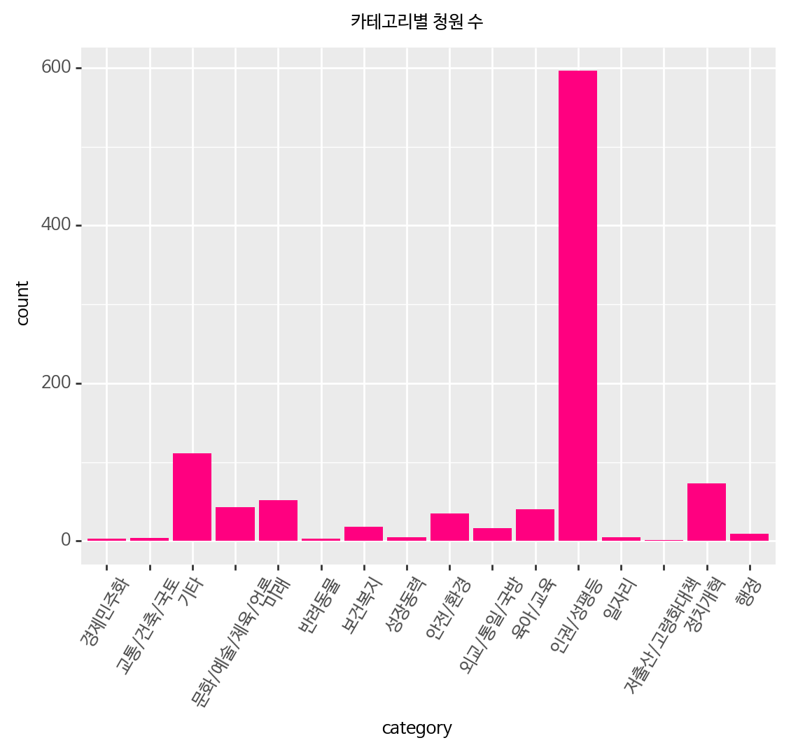
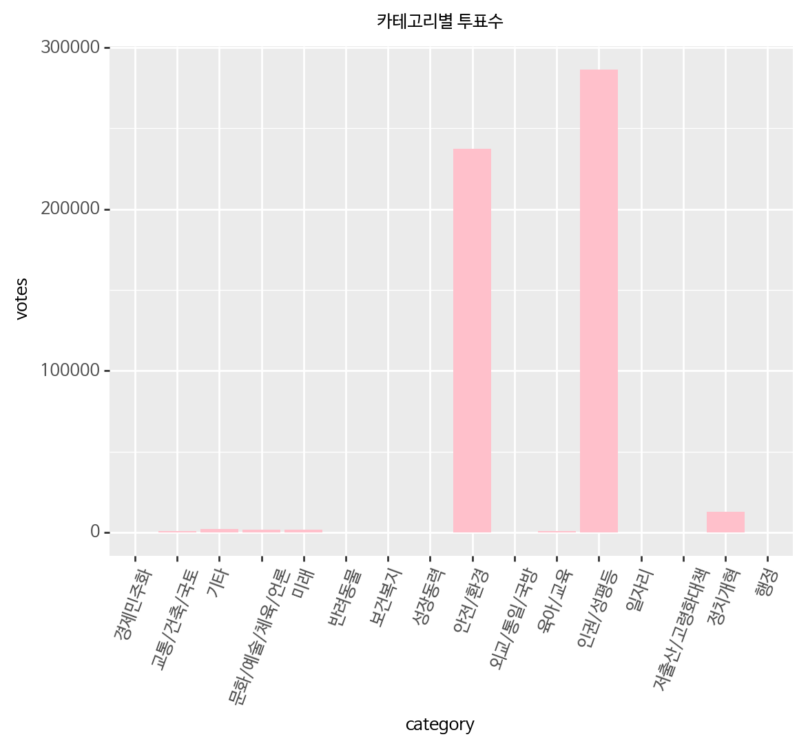
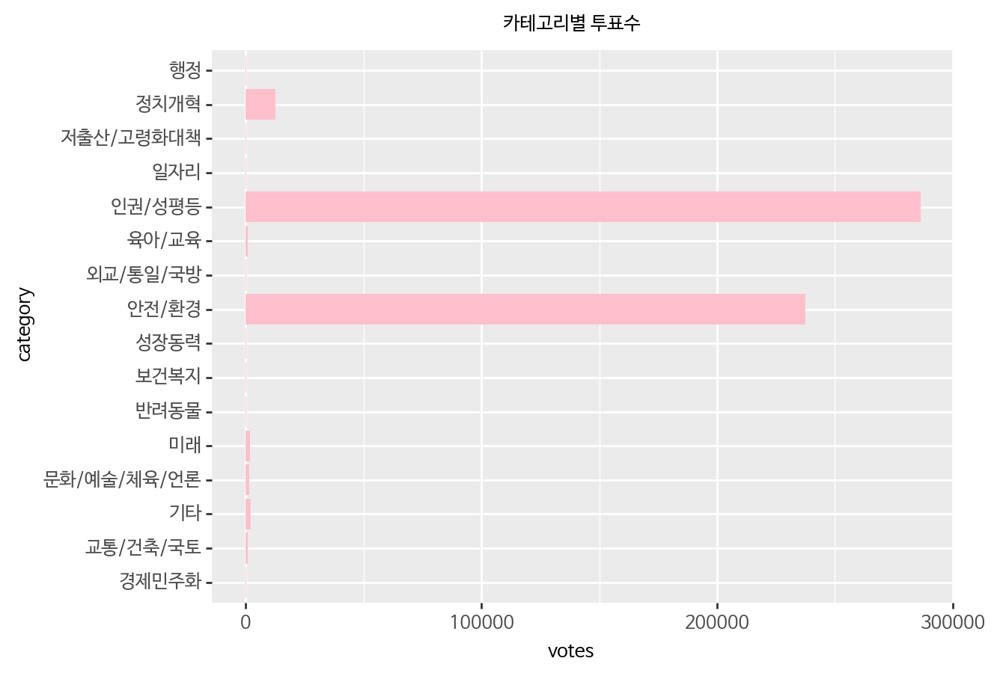
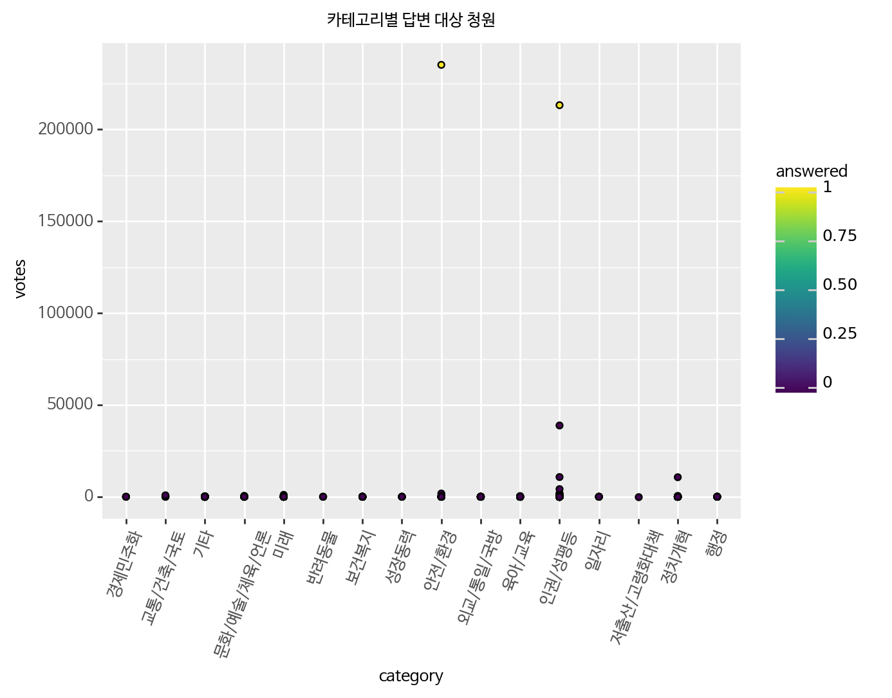
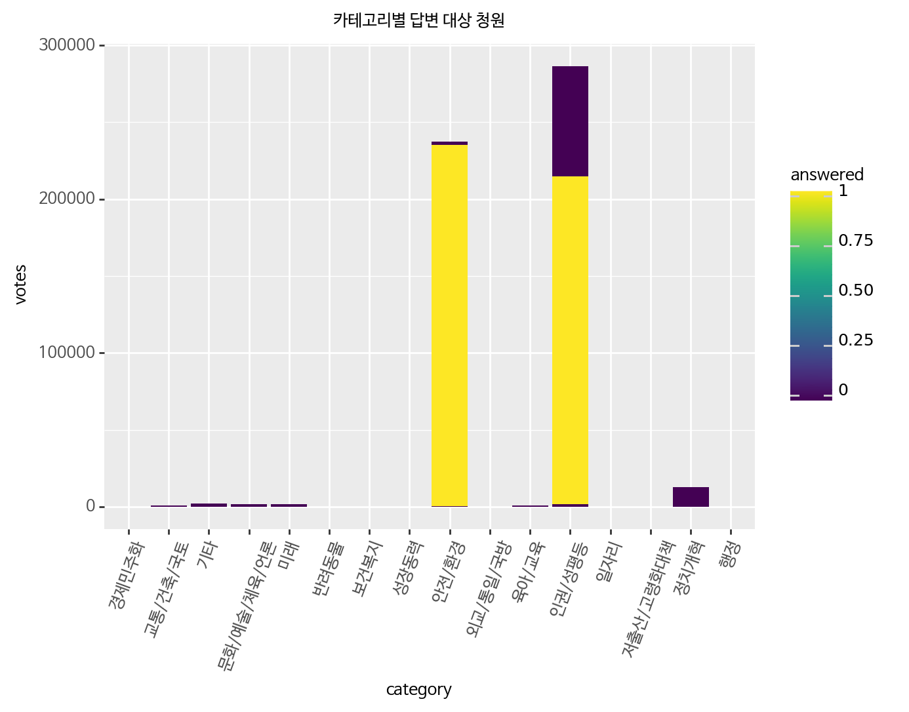
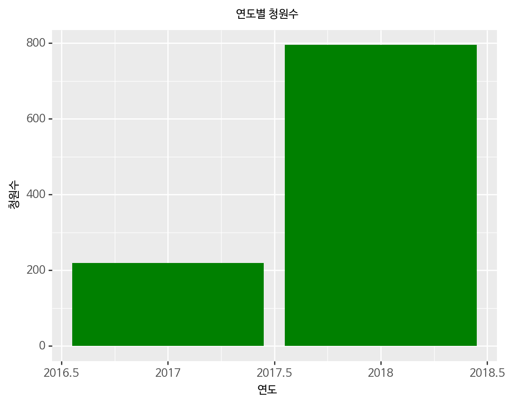
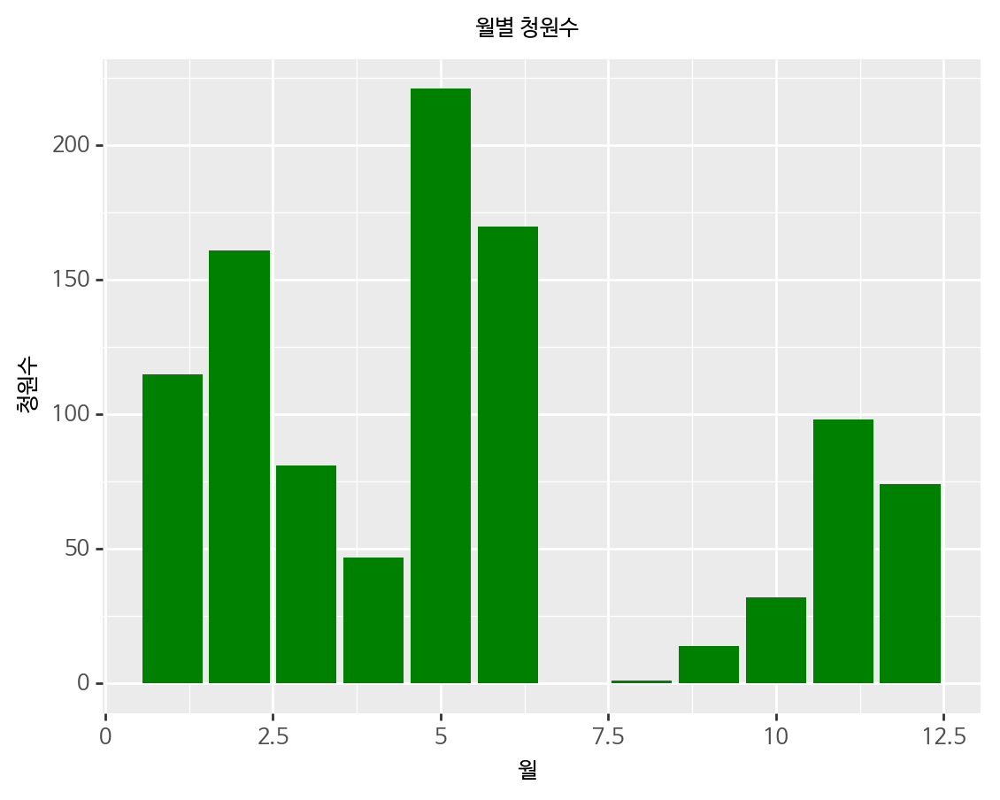
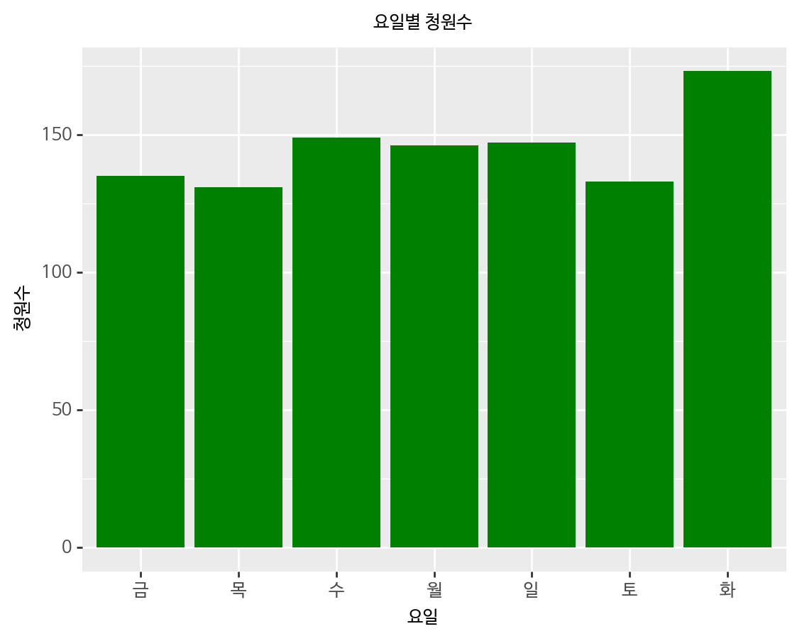
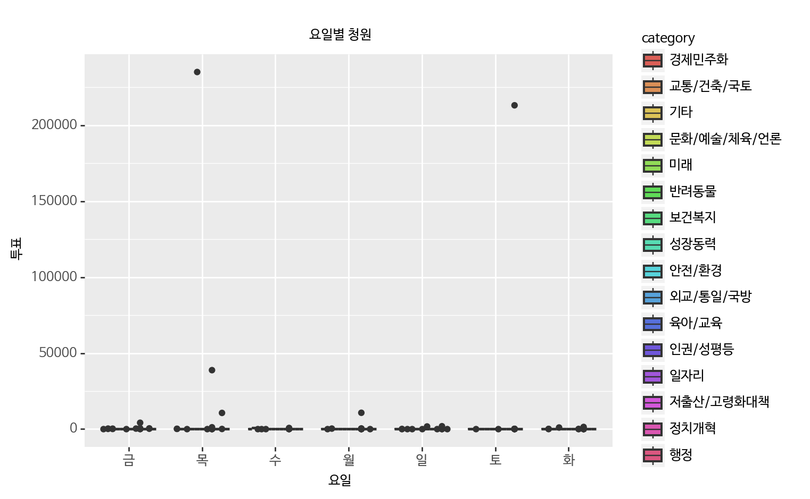
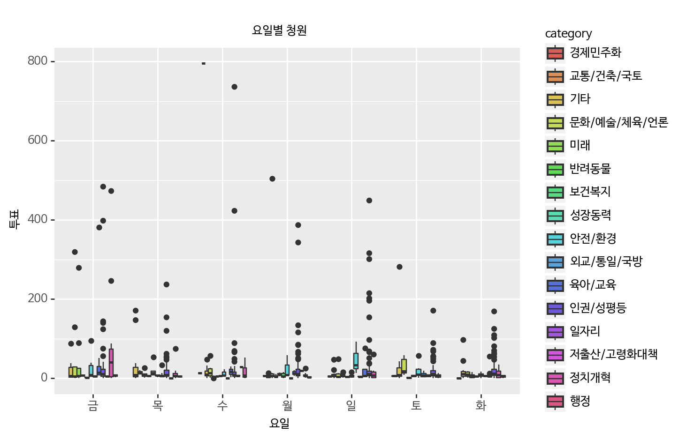

# [A Grammar of Graphics for Python — plotnine](http://plotnine.readthedocs.io/en/stable/index.html)
* [tutorial](http://plotnine.readthedocs.io/en/stable/tutorials.html)
* [ggplot2-cheatsheet](https://www.rstudio.com/wp-content/uploads/2015/03/ggplot2-cheatsheet.pdf)


```python
!pip install -q 'plotnine[all]'
```


```python
!pip show plotnine
```

    Name: plotnine
    Version: 0.3.0
    Summary: A grammar of graphics for python
    Home-page: https://github.com/has2k1/plotnine
    Author: Hassan Kibirige
    Author-email: has2k1@gmail.com
    License: GPL-2
    Location: /usr/local/lib/python3.6/dist-packages
    Requires: pandas, patsy, six, matplotlib, mizani, numpy, statsmodels, scipy
    Required-by: 


```python
import pandas as pd
import numpy as np
print(pd.__version__)
print(np.__version__)
```

    0.22.0
    1.14.5
    


```python
# 불필요한 warnings을 찍지 않기 위해 import 해왔습니다. 
import warnings
warnings.filterwarnings('ignore')

%config InlineBackend.figure_format = 'retina'

!apt -qq -y install fonts-nanum > /dev/null
import matplotlib.font_manager as fm
fontpath = '/usr/share/fonts/truetype/nanum/NanumBarunGothic.ttf'
font = fm.FontProperties(fname=fontpath, size=9)

from plotnine import *
import plotnine
```

    
    WARNING: apt does not have a stable CLI interface. Use with caution in scripts.
    


```python
# 크롤링해 온 국민청원 데이터를 판다스를 통해 읽어온다.
df = pd.read_csv('https://s3.ap-northeast-2.amazonaws.com/data10902/petition/petition.csv', 
                 parse_dates=['start', 'end'])

# 데이터의 크기가 어느정도인지 본다.
df.shape
```


    (215154, 8)


```python
# 전체 데이터로 보면 너무 느리기 때문에 본인의 관심사에 맞는 데이터를 가져옵니다.
aversion = df.loc[(df.title.str.contains('혐오|일베|페미|워마드|한남|맘충|꼰대', regex=True)) & \
                  (df.content.str.contains('혐오|일베|페미|워마드|한남|맘충|꼰대', regex=True))] 
aversion.shape
```


    (1014, 8)


```python
aversion.head(3)
```


<div>
<style scoped>
    .dataframe tbody tr th:only-of-type {
        vertical-align: middle;
    }

    .dataframe tbody tr th {
        vertical-align: top;
    }

    .dataframe thead th {
        text-align: right;
    }
</style>
<table border="1" class="dataframe">
  <thead>
    <tr style="text-align: right;">
      <th></th>
      <th>article_id</th>
      <th>start</th>
      <th>end</th>
      <th>answered</th>
      <th>votes</th>
      <th>category</th>
      <th>title</th>
      <th>content</th>
    </tr>
  </thead>
  <tbody>
    <tr>
      <th>604</th>
      <td>632</td>
      <td>2017-08-26</td>
      <td>2017-11-24</td>
      <td>0</td>
      <td>15</td>
      <td>기타</td>
      <td>일베의 만행</td>
      <td>안녕하십니까\n일베의 만행이 도를 넘어선것같아 알려드리고자 청원을 올립니다.\n일베...</td>
    </tr>
    <tr>
      <th>1454</th>
      <td>1483</td>
      <td>2017-09-02</td>
      <td>2017-12-01</td>
      <td>0</td>
      <td>4</td>
      <td>인권/성평등</td>
      <td>문재인 대통령님이 정말 페미니스트 대통령이 맞나요?</td>
      <td>정말 페미니스트신가요?\n페미니스트가 뭔지 제대로 알고 페미니스트 대통령이라고 한 ...</td>
    </tr>
    <tr>
      <th>1521</th>
      <td>1550</td>
      <td>2017-09-02</td>
      <td>2017-10-02</td>
      <td>0</td>
      <td>15</td>
      <td>인권/성평등</td>
      <td>남성혐오를 지지하는 정치인들과 정당, 페미니스트들을 청와대는 당장 추방하라!!</td>
      <td>페미니즘을 추종하는 정치인들중 일부가 메갈리아와 워마드를 지지하고 있습니다. 그리고...</td>
    </tr>
  </tbody>
</table>
</div>


```python
aversion.tail(3)
```


<div>
<style scoped>
    .dataframe tbody tr th:only-of-type {
        vertical-align: middle;
    }

    .dataframe tbody tr th {
        vertical-align: top;
    }

    .dataframe thead th {
        text-align: right;
    }
</style>
<table border="1" class="dataframe">
  <thead>
    <tr style="text-align: right;">
      <th></th>
      <th>article_id</th>
      <th>start</th>
      <th>end</th>
      <th>answered</th>
      <th>votes</th>
      <th>category</th>
      <th>title</th>
      <th>content</th>
    </tr>
  </thead>
  <tbody>
    <tr>
      <th>215083</th>
      <td>277959</td>
      <td>2018-06-20</td>
      <td>2018-07-20</td>
      <td>0</td>
      <td>6</td>
      <td>인권/성평등</td>
      <td>메갈,일베 처벌법 만들어주세요.</td>
      <td>요즘  페미니스트라면서 SNS에서 한국남자들을 비하하거나 자신은 여자여서 더 약하고...</td>
    </tr>
    <tr>
      <th>215131</th>
      <td>278019</td>
      <td>2018-06-20</td>
      <td>2018-07-20</td>
      <td>0</td>
      <td>3</td>
      <td>인권/성평등</td>
      <td>경상북도 교육청, 워마드 사이트도 막아주세요!</td>
      <td>경상북도의 어느 한 학교에 다니는 학생입니다.\n최근 들어 세간에서 성평등에 대한 ...</td>
    </tr>
    <tr>
      <th>215135</th>
      <td>278023</td>
      <td>2018-06-20</td>
      <td>2018-07-20</td>
      <td>0</td>
      <td>16</td>
      <td>인권/성평등</td>
      <td>페미니스트시위하는분들처벌해주세요</td>
      <td>페미니스트의가면을쓴여성우월주의자들입니다\n이것은 성평등에어긋납니다</td>
    </tr>
  </tbody>
</table>
</div>


```python
aversion.info()
```

    <class 'pandas.core.frame.DataFrame'>
    Int64Index: 1014 entries, 604 to 215135
    Data columns (total 8 columns):
    article_id    1014 non-null int64
    start         1014 non-null datetime64[ns]
    end           1014 non-null datetime64[ns]
    answered      1014 non-null int64
    votes         1014 non-null int64
    category      1014 non-null object
    title         1014 non-null object
    content       1014 non-null object
    dtypes: datetime64[ns](2), int64(3), object(3)
    memory usage: 71.3+ KB
    


```python
aversion.describe(include=np.object)
```


<div>
<style scoped>
    .dataframe tbody tr th:only-of-type {
        vertical-align: middle;
    }

    .dataframe tbody tr th {
        vertical-align: top;
    }

    .dataframe thead th {
        text-align: right;
    }
</style>
<table border="1" class="dataframe">
  <thead>
    <tr style="text-align: right;">
      <th></th>
      <th>category</th>
      <th>title</th>
      <th>content</th>
    </tr>
  </thead>
  <tbody>
    <tr>
      <th>count</th>
      <td>1014</td>
      <td>1014</td>
      <td>1014</td>
    </tr>
    <tr>
      <th>unique</th>
      <td>16</td>
      <td>957</td>
      <td>975</td>
    </tr>
    <tr>
      <th>top</th>
      <td>인권/성평등</td>
      <td>여성단체(워마드 등 메갈사이트 포함) 세무조사 및 감사원 감사 청원합니다</td>
      <td>무소불위 권력단체로 1000여 개 이상 국내 난립해 있는 여성 단체들(워마드 등 메...</td>
    </tr>
    <tr>
      <th>freq</th>
      <td>596</td>
      <td>25</td>
      <td>12</td>
    </tr>
  </tbody>
</table>
</div>


## 시계열 데이터 보기


```python
aversion.dtypes
```


    article_id             int64
    start         datetime64[ns]
    end           datetime64[ns]
    answered               int64
    votes                  int64
    category              object
    title                 object
    content               object
    dtype: object


```python
aversion['start_year'] = aversion['start'].dt.year
aversion['start_month'] = aversion['start'].dt.month
aversion['start_day'] = aversion['start'].dt.day
aversion['start_hour'] = aversion['start'].dt.hour
aversion['start_dow'] = aversion['start'].dt.dayofweek
aversion['start_wdn'] = aversion['start'].dt.weekday_name

# 요일을 좀 더 간단하게 표현해 봅니다.
days = {0:'Mon',1:'Tues',2:'Weds',3:'Thurs',4:'Fri',5:'Sat',6:'Sun'}
aversion['start_dayofweek'] = aversion['start_dow'].apply(lambda x: days[x])
aversion.shape
```


    (1014, 15)


```python
days = {0:'월',1:'화',2:'수',3:'목',4:'금',5:'토',6:'일'}
aversion['start_dayofweek'] = aversion['start_dow'].apply(lambda x: days[x])
# apply는 매 행마다 괄호 안의 내용을 반영해줌
aversion['start_dayofweek'].value_counts()
```


    화    173
    수    149
    일    147
    월    146
    금    135
    토    133
    목    131
    Name: start_dayofweek, dtype: int64


```python
# 월별 데이터 보기
aversion['start_month'].value_counts()
```


    5     221
    6     170
    2     161
    1     115
    11     98
    3      81
    12     74
    4      47
    10     32
    9      14
    8       1
    Name: start_month, dtype: int64


```python
# 요일별 데이터 보기
aversion['start_dayofweek'].value_counts()
```


    화    173
    수    149
    일    147
    월    146
    금    135
    토    133
    목    131
    Name: start_dayofweek, dtype: int64


```python
# 요일별 데이터 보기

aversion['start_wdn'].value_counts()
```


    Tuesday      173
    Wednesday    149
    Sunday       147
    Monday       146
    Friday       135
    Saturday     133
    Thursday     131
    Name: start_wdn, dtype: int64


## 한글폰트 사용하기
* 한글이 깨져보이는 것을 해결하기 위해 한글폰트를 사용해야 합니다.
* 여기에서는 나눔바른고딕을 사용하도록 합니다.
    * 이때 폰트가 로컬 컴퓨터에 설치되어 있어야해요.
    * 나눔고딕은 무료로 사용할 수 있는 폰트입니다.
    * 참고 : [네이버 나눔글꼴 라이선스](https://help.naver.com/support/contents/contents.nhn?serviceNo=1074&categoryNo=3497)
* 한글을 사용하기 위해서는 ggplot에서 theme에 폰트를 지정해 주면됩니다.
* 아래의 문서를 참고하면 **element_text**와 관련된 옵션을 볼 수 있습니다.
* 참고 : [plotnine.themes.element_text — plotnine 0.3.0 documentation](http://plotnine.readthedocs.io/en/stable/generated/plotnine.themes.element_text.html)


```python
# 카테고리별 청원 수
(ggplot(aversion)
 + aes('category')
 + geom_bar(fill='#FF0080')
 + ggtitle('카테고리별 청원 수')
 + theme(text=element_text(fontproperties=font),
        axis_text_x=element_text(rotation=60))
)
```





    <ggplot: (-9223363255759817342)>


```python
# 카테고리별 투표수
(ggplot(aversion)
 + aes(x='category', y='votes')
 + geom_col(fill='pink')
 + ggtitle('카테고리별 투표수')
 + theme(text=element_text(fontproperties=font),
        axis_text_x=element_text(rotation=70))
)
```





    <ggplot: (8781094580316)>


```python
# coord_flip을 사용해서 x축과 y축을 바꿔본다.
(ggplot(aversion)
 + aes(x='category', y='votes')
 + geom_col(fill='pink')
 + ggtitle('카테고리별 투표수')
 + coord_flip()  # 가로 세로를 바꾸어서 보여줌
 + theme(text=element_text(fontproperties=font))
)
```





    <ggplot: (8781090869666)>


```python
(ggplot(aversion) 
 + aes(x='category', y='votes', fill='answered')
 + geom_point()
 + ggtitle('카테고리별 답변 대상 청원')
 + theme(text=element_text(fontproperties=font),
        axis_text_x=element_text(rotation=70))
)
```





    <ggplot: (-9223363255764027739)>


```python
(ggplot(aversion, aes(x='category', y='votes', fill='answered'))
 + geom_col()
 + ggtitle('카테고리별 답변 대상 청원')
 + theme(text=element_text(fontproperties=font),
        axis_text_x=element_text(rotation=70))
)
```





    <ggplot: (-9223363255760190169)>


```python
# 연도별 청원수는 크게 의미가 없다.
(ggplot(aversion)
 + aes('start_year')
 + geom_bar(fill='green')
 + labs(y='청원수', x='연도', title='연도별 청원수')
 + theme(text=element_text(fontproperties=font))
)
```





    <ggplot: (-9223363255764041521)>


```python
(ggplot(aversion)
 + aes('start_month')
 + geom_bar(fill='green')
 + labs(y='청원수', x='월', title='월별 청원수')
 + theme(text=element_text(fontproperties=font))
)
```





    <ggplot: (8781090524543)>


```python
(ggplot(aversion)
 + aes('start_dayofweek')
 + geom_bar(fill='green')
 + labs(y='청원수', x='요일', title='요일별 청원수')
 + theme(text=element_text(fontproperties=font))
)
```





    <ggplot: (8781090445162)>


```python
# 박스플롯을 그려볼까요?
(ggplot(aversion, aes(x='start_dayofweek', y='votes', fill='category'))
 + geom_boxplot()
 + labs(y='투표', x='요일', title='요일별 청원')
 + theme(text=element_text(fontproperties=font))
)
```





    <ggplot: (-9223363255764349338)>


```python
# 그래프를 좀 더 자세하게 보기 위해 투표수가 특정 건 이하인 데이터만 모아본다.
aversion_votes_1000 = aversion.loc[aversion['votes'] < 1000]

(ggplot(aversion_votes_1000, aes(x='start_dayofweek', y='votes', fill='category'))
 + geom_boxplot()
 + labs(y='투표', x='요일', title='요일별 청원')
 + theme(text=element_text(fontproperties=font))
)
```





    <ggplot: (-9223363255764345947)>


